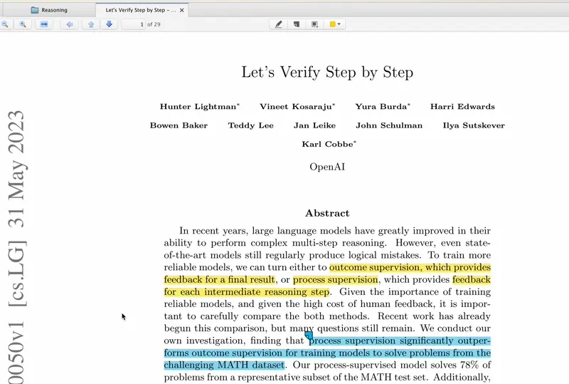

# Open Inline Citation
## CMD-click an inline citation to read it in a new tab.

A nice little plugin for Zotero 6 (and hopefully 7, I haven't tested).

## Installation

1. Download `open-inline-citation.xpi` from [this page](https://github.com/andrew-healey/open-inline-citation/releases/latest).

2. Open Zotero, go to Tools > Add-ons > gear icon > Install Add-on From File... and select the `open-inline-citation.xpi` file.

3. CMD-click an inline citation to read it in a new tab.

